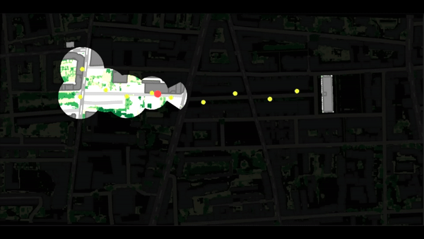
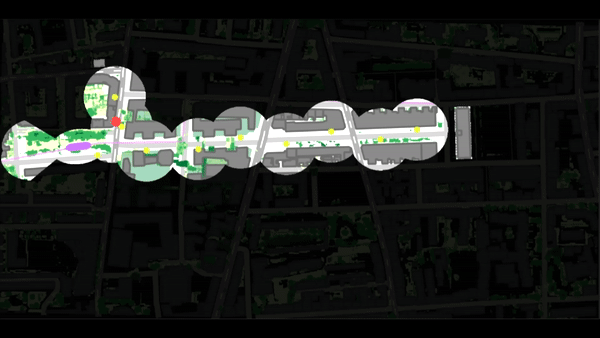

# Atelier à quoi réve les maquette - Immersion Temporelle

## Description 
Le dispositif présenté vise à mettre en avant l'apaisement qui interviendra au niveau de l'ambiance sonore du nouveau quartier Gratte Ciel une fois les travaux finalisés à l'horizon 2030. Pour cela, nous vous proposons dans un premier temps, de parcourir un trajet de nos jour en écoutant les différents sons que l'on peut entendre dans le quartier. Et dans un deuxième temps d'effectuer le parcours inverse en imaginant l'ambiance sonore une fois les travaux finis.
En plus des sons, le spectateur peut suivre le trajet de l'agent via une projection sur une maquette en lego représentant le relief de Gratte Ciel.

Ce projet a été réalisé par :
- Brice IDE
- Samuel JOULIE
- Luigi LUSATTI
- Hugo PASQUIER : [Linkedin](https://www.linkedin.com/in/hugo-pasquier-7b6353202/) -

## Aperçu

